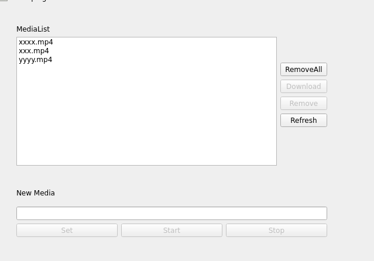

# Media manager

ROS2 util package to save image message to mp4 files  
Allow to manage mp4 media files on remote node

The Workspace build from 3 packages:

- media_manage: register to image message and save it as mp4, use opencv
- media_manager_interfaces: helper message to manage media on remote
- rqt_media_manager_control: rqt plugin to manage media


---

## media_manager

```bash
ros2 run media_manager manager.py 
```
| parameter | desc | defaults |
|---------|-----------|-----------------|
| media_fps        |           |                 |
| media_height        |           |                 |
| media_location        | where to save mp4 files          |                 |
| media_width        |           |                 |


  
  
  
  
  

## rqt_media_manager_control



### usage

#### create new media

Enter media name and click `Set` the set operation prepared the media file but **not start** to record
`Start` save frames to media file, `Stop` close the file and release opencv writer , it's not possible to continue record after Stop operation.


#### Manage media
- Refresh: reload media list from remote
- Remove: Delete selected media
- Download: Download selected media to user(local) machine using `scp`
- RemoveAll: Remove all mp4 remote media

---

### Todo:
- Add pause operation
- subscribe to image_info message
- disabled remove all and remove in mode start